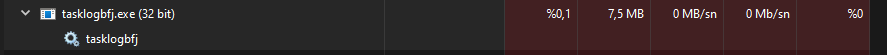

 @ny4rlk0 => @neptune1881
 <a href="https://github.com/neptune1881/VirusesThatIFoundInRandomly/releases/download/BossBotnetVirusSourceCode/BossBotnetSourceCode.zip">Download Source Code</a>
 This is a attempt to reverse engineering a virus. 
 Well if you f*ck with peoples accounts. Eventually you will hit a wrong person.
 Do not download it if you dont know what you doing.
 PW:12345
 
 Bu bir zararlı yazılımın tersine mühendislikle kaynak kodunun okunup ne yaptığını ve hangi ip adreslerini kullandığını tahmin etmeye yönelik bir repodur.
 Ne yaptığınızı bilmiyorsanız indirmeyin.
 Şifre: 12345
 File 1:
 C:\Windows\Temp\.net\tasklogbfj\GupvexkK5h6CtBiSoOQWqihC_0LsQQc=\BossBotnet.Client.Shared.dll
 File 2:
 C:\Users\username\AppData\Roaming\taskulsokprooe\tasklogbfj.exe
 Kaldırma / Uninstall
 CMD => Administrator
 sc stop tasklogbfj.exe
 sc delete tasklogbfj.exe
 Sonra dosya 1 ve 2'yi silin.
 Then delete file 1 and 2.
 Reboot / Yeniden Başlat
 
 
 To unhide:
 attrib -s -h tasklogbfj.exe
 
 Gözlemler/ Observations
 (?) Emin olmadığım kısımlar. Kodların birazına göz attığım için çıkarımlarım.
 Bilgisayardaki twitch hesaplarına erişiyor, bot ekliyor, küçük ve büyük twitch hesaplarına farklı davranışlarda bulunuyor.
 Visual studio 2010 C# ile yazılmış.
 Kendisini sistem başlangıcına servis olarak ekliyor.
 Yönetici seviyesinde komut satırı erişimi var (?)
 Bulaştıran muhtemel zararlılar
  www.pushbane.online (?)
  https://discord.gg/2tPhNKDc
 ------------------------------
 cheat global
  cheatglobal.com (?)
  https://discord.gg/774MKHjZ
 ------------------------------
 Bilinmeyen 3. aktör (?)
  Orjinal Github hesabımı mahveden kısım buydu sanırım.
  Github da virüs gibi çoğalan repolar
 
 3. Aktörün IP Adresi (VPN):
 
 46.8.202.228 Amsterdam, North Holland, Netherlands
 
 IP Details For: 46.8.202.228
 
 Decimal: 772328164
 
 Hostname: 46.8.202.228
 
 ASN: 44477
 
 ISP: Netart LIR K.S.
 
 Services: VPN Server
 
 Assignment: Likely Static IP
 
 Country: Netherlands
 
 State/Region: Drenthe
 
 City: Meppel
 
 
 
 Repo açıklamaları birbirine benziyor.
 Repo explanation is all similiar its not just for point blank for varius game's name.
